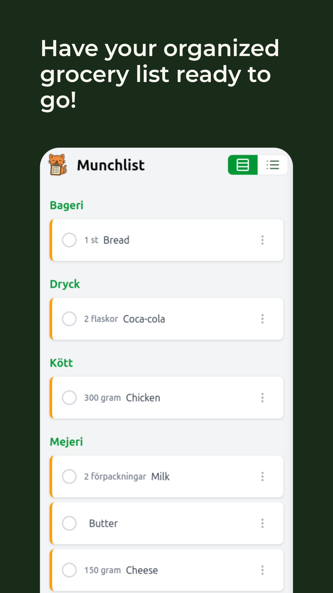
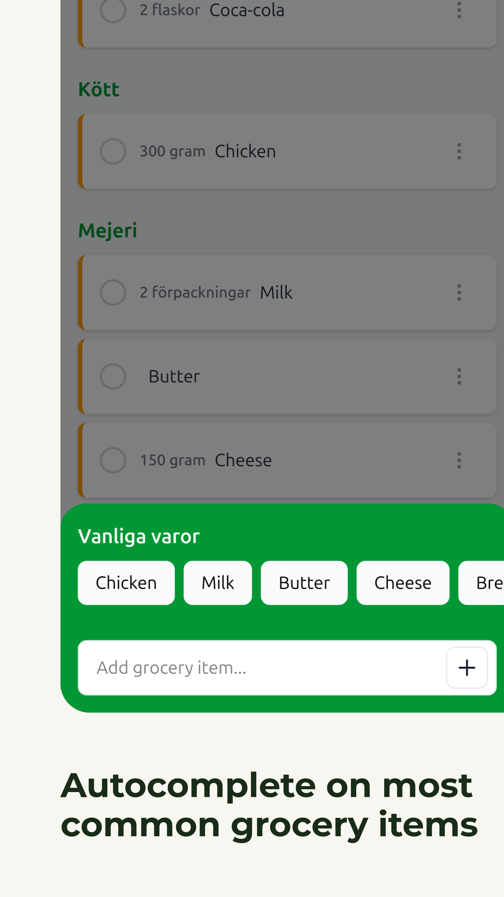
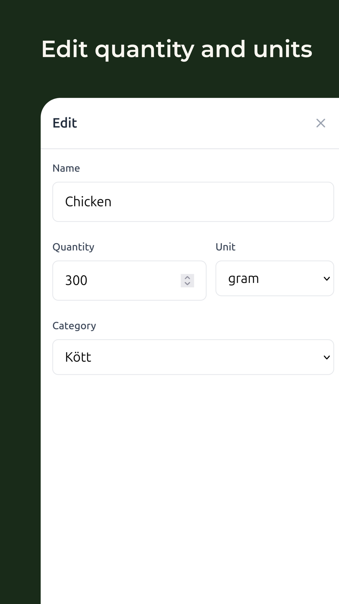

<!-- PROJECT LOGO -->
 

  

<h3 align="center">Munchlist</h3>

  

    A simple, grocery shopping companion.
     
    <a href="https://demo.booklogr.app">💻Go to web app</a> |
    <a href="https://github.com/Mozzo1000/munchlist/issues">🐞Report Bug</a> |
    <a href="https://github.com/Mozzo1000/munchlist/issues">✨Request Feature</a> |
  

## 👉About the project

**Munchlist** is a simple, fast, and user-friendly grocery shopping companion built with React.  
It helps you manage your shopping list with smart suggestions, categories, and a delightful mobile-first experience.

  
   
  

## ✨ Features

- **Smart Autocomplete**  
  Get instant suggestions from a built-in database of common grocery items as you type.

- **Custom Items**  
  Add your own items to the suggestion list. Edit or remove them at any time.

- **Organize by Category**  
  Switch between a simple list view and a categorized view (produce, dairy, meat, etc.).

- **Quantities & Units**  
  Specify exact amounts and units for each item (e.g., "2.5 kg potatoes", "3 cans tomatoes").

- **Mobile-First Design**  
  Fully responsive and touch-friendly.

- **Persistent Storage**  
  Your list and custom items are saved locally in your browser.

## 🙌Contributing

All contributions, from bug reports to feature requests and code submissions are welcome!

## 🧾License

This project is licensed under the Apache License, Version 2.0. See [LICENSE](LICENSE) for the full license text.
